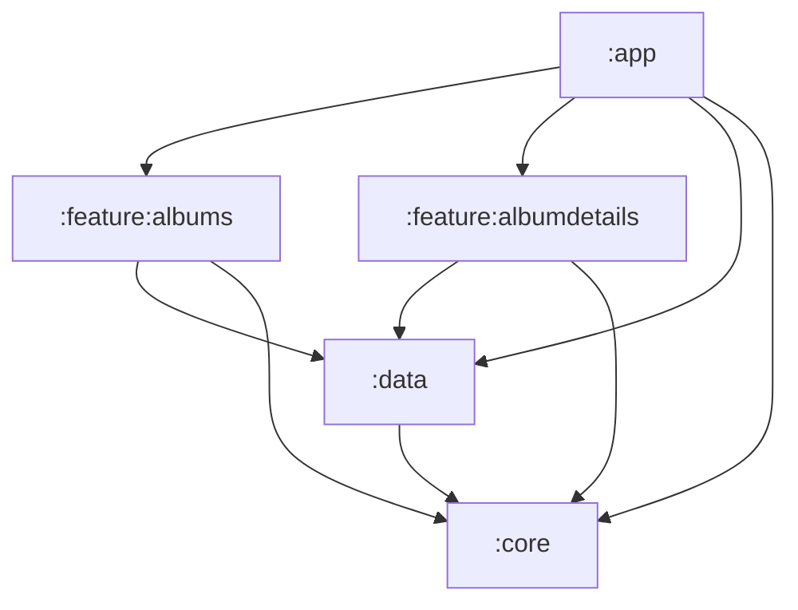

# Architecture

## 1. Principes retenus

L'application suit une **architecture en couches** couplée au pattern **MVVM** et à
un **flux de données unidirectionnel** :

- l'UI émet des intentions (`onQueryChange`, `onToggleFavorite`, `refresh`) ;
- le ViewModel produit un unique `StateFlow<UiState>` ;
- la donnée descend toujours dans le même sens : **base locale → repository → UI**.

Trois règles guident le découpage :

1. **La base de données est la source de vérité.** Le réseau ne fait qu'alimenter Room.
   L'écran n'observe jamais directement une réponse HTTP. C'est ce qui rend le mode hors
   ligne, la persistance après redémarrage et la survie des favoris quasiment gratuits.
2. **Les dépendances pointent vers le bas.** `:feature:*` ne connaît que l'interface
   `AlbumsRepository` et les use cases exposés par `:data` ; il ignore Retrofit et Room.
   `:data` ne connaît que les modèles et l'abstraction des dispatchers exposés par `:core`.
3. **Un modèle par couche.** `AlbumDto` (réseau) → `AlbumEntity` (stockage) → `Album`
   (métier) → `AlbumUi` (présentation). Le coût est de quelques mappers ; le bénéfice est
   qu'un changement de contrat d'API ne se propage pas jusqu'aux composables.

## 2. Graphe des modules

| Module | Type | Responsabilité |
| --- | --- | --- |
| `:app` | application | Activité unique, graphe de navigation, thème, configuration Hilt |
| `:feature:albums` | android lib | Liste groupée, recherche, filtre favoris |
| `:feature:albumdetails` | android lib | Écran de détail d'une photo |
| `:data` | android lib | Retrofit, Room, mappers, use cases, implémentation du repository |
| `:core` | android lib | Modèles métier, abstraction des dispatchers, design system (thème Spark, composants partagés) |

**Pourquoi ce découpage ?** Cinq modules, un par responsabilité claire :

- `:core` regroupe tout ce qui est *partagé et stable* — modèles, dispatchers, composants
  UI — sans dépendre de rien d'autre dans le projet ;
- `:data` regroupe toute la logique d'accès aux données (réseau, base, repository, use
  cases) : un feature module qui veut lire ou écrire une donnée passe par ce seul module ;
- les deux `:feature:*` restent interchangeables et ne dépendent jamais l'un de l'autre ;
- `:app` ne contient que du câblage (Hilt, navigation) et zéro logique testable.

Le projet a délibérément été gardé à cinq modules plutôt que d'éclater `:data` en
network/database/domain/data séparés : à l'échelle de deux écrans, cette granularité
supplémentaire n'achète pas grand-chose (le vrai bénéfice — paralléliser les builds —
demande beaucoup plus de code avant de se voir) et complique la lecture du projet sans
raison. La frontière qui compte réellement est **feature vs data vs core**, et elle est
bien présente : un feature module ne peut physiquement pas importer Retrofit ou Room, la
dépendance n'existe pas dans son `build.gradle.kts`.

## 3. Flux de données

**Affichage.** `AlbumsDao.observeAlbums()` (jointure albums + favoris, triée par SQLite)
→ `AlbumsRepositoryImpl` mappe vers le modèle métier sur `Dispatchers.Default`
→ `ObserveAlbumsUseCase` combine avec les critères utilisateur (recherche, filtre) et
regroupe par album → `AlbumsViewModel` transforme en `AlbumsUiState` et publie via
`stateIn(WhileSubscribed(5_000))` → l'écran collecte avec `collectAsStateWithLifecycle()`.

**Synchronisation.** `refresh()` appelle le `AlbumsRemoteDataSource`, qui traduit toute
exception (`IOException`, `HttpException`, `SerializationException`) en `RemoteException`.
`AlbumsRepositoryImpl` la convertit en `DataError` métier. En cas de succès, un `UPSERT`
alimente Room, qui ré-émet automatiquement vers l'UI. **Aucune exception ne remonte à la
couche présentation** : le ViewModel manipule un `RefreshResult`, pas un `try/catch`.

**Favoris.** Table `favorites` séparée, jointe en `LEFT JOIN`. Une resynchronisation
écrase les lignes `albums` mais ne touche jamais aux favoris : la donnée saisie par
l'utilisateur ne peut pas être perdue par une opération réseau.

## 4. Gestion des changements de configuration

C'est un critère éliminatoire de l'énoncé, traité à quatre niveaux :

1. **ViewModel** : survit à la rotation, aucun `android:configChanges` dans le manifeste —
   on gère le changement, on ne le neutralise pas.
2. **`StateFlow` + `stateIn(WhileSubscribed(5_000))`** : l'état reste chaud pendant les
   5 secondes qui suivent la disparition du dernier collecteur. Une rotation ne relance ni
   la requête SQL, ni le regroupement des 5 000 éléments, ni un appel réseau. Le projet
   initial utilisait un `MutableSharedFlow` sans `replay` : l'émission était perdue et
   l'écran revenait vide.
3. **`SavedStateHandle`** pour la recherche et le filtre : ils survivent en plus à la mort
   du processus (application en arrière-plan tuée par le système).
4. **`rememberLazyListState`** : la position de scroll est restaurée.

Deux tests unitaires verrouillent ce comportement (`state and search survive the loss of
the collector`, `restores the query saved before a process death`).

## 5. Performance

Le jeu de données fait ~5 000 éléments : c'est le vrai sujet de perf de l'exercice.

- **Tri et jointure en SQL**, avec un index sur `album_id` — pas de tri en Kotlin à chaque
  émission.
- **Filtrage et regroupement sur `Dispatchers.Default`** via `flowOn`, jamais sur le thread
  principal.
- **`debounce` variable** sur la recherche : 0 ms quand le champ est vide (affichage
  initial instantané), 250 ms sinon.
- **`LazyColumn` avec `key` stable et `contentType`** : Compose réutilise les items au lieu
  de tout recomposer, et différencie en-têtes et lignes.
- **`UPSERT` plutôt que `DELETE` + `INSERT`** : la liste n'est jamais vidée pendant une
  synchronisation, donc pas de clignotement.
- **Un seul `OkHttpClient`** partagé par Retrofit et Coil (un pool de connexions, un pool de
  threads), plus un cache disque images de 50 Mo pour l'affichage hors ligne.
- **`minifyEnabled` + `shrinkResources`** en release.

## 6. Justification des librairies

| Librairie | Alternatives écartées | Raison du choix |
| --- | --- | --- |
| **Hilt** | Koin, service locator maison | L'énoncé demande de l'injection de dépendances ; Hilt vérifie le graphe **à la compilation** (une dépendance manquante casse le build, pas l'exécution), gère les portées Android et s'intègre nativement aux ViewModels. Koin resterait un service locator résolu à l'exécution. |
| **Room** | DataStore, fichiers JSON, SQLDelight | Persistance requise pour 5 000 lignes avec requêtes, tri, jointure et observation réactive. Room vérifie le SQL à la compilation et exporte des schémas versionnés pour les migrations. |
| **Retrofit + kotlinx.serialization** | Ktor, Moshi, Gson | Retrofit était déjà en place. kotlinx.serialization génère les serializers à la compilation (pas de réflexion, meilleur démarrage, compatible R8) là où Gson réfléchit à l'exécution. |
| **Coil 3** | Glide, Picasso | API pensée pour Compose, partage du `OkHttpClient` existant, cache mémoire + disque intégrés. |
| **Navigation Compose type-safe** | Activités multiples, routes en `String` | Corrige directement deux bugs du projet initial (double icône de lanceur, détail sans argument). Les arguments sont vérifiés à la compilation. |
| **Spark** | Material 3 seul | C'est le design system leboncoin, déjà présent dans le projet ; on garde `SparkTheme`, `Card` et `ChipTinted`, et on complète avec Material 3 pour ce que Spark n'expose pas. |
| **Turbine** | `first()`, `take(n).toList()` | Tester un `Flow` à la main mène vite à des tests non déterministes ; Turbine impose de consommer chaque émission. |
| **Fakes écrits à la main** | MockK, Mockito | Voir [`TESTS.md`](TESTS.md) : les fakes sont typés, refactorables, et ne cassent pas au moindre changement de signature. Une dépendance de moins. |

## 7. Ce qui a été volontairement écarté

- **Paging 3** : 5 000 lignes tiennent en mémoire (~1 Mo) et l'API renvoie tout d'un bloc,
  sans pagination serveur. Ajouter Paging complexifierait la couche données pour un gain
  nul aujourd'hui. C'est le premier candidat si le volume augmente (voir
  [`EVOLUTIONS.md`](EVOLUTIONS.md)).
- **Éclater `:data` en modules network / database / domain séparés** : c'est la structure
  la plus courante dans les projets multi-modules à grande échelle, mais elle se justifie
  quand plusieurs équipes ou plusieurs apps consomment les mêmes couches indépendamment.
  Avec un seul consommateur de données ici, la frontière `:data` suffit et reste plus
  simple à naviguer. Le refactor vers des sous-modules reste mécanique si le projet grossit.
- **Convention plugins Gradle (`build-logic`)** : justifiée au-delà d'une dizaine de
  modules ; ici la configuration reste lisible module par module. Également listé dans les
  évolutions.